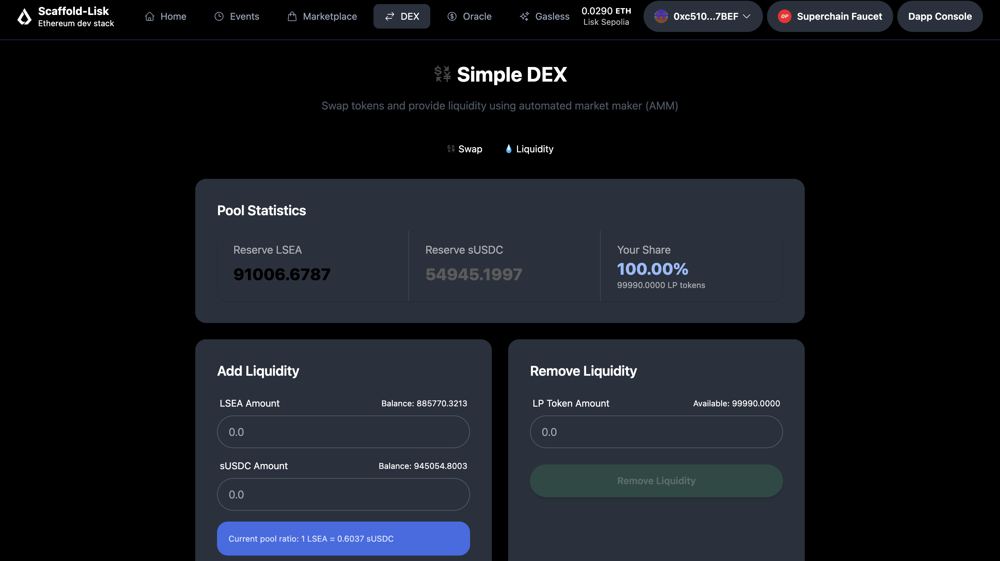

# 💧 SimpleDEX — Lisk Challenge Week 6  
**Author:** sztch  

A simple decentralized exchange (DEX) built on **Lisk Sepolia**, allowing users to add/remove liquidity and swap tokens through an automated market maker (AMM) model (x * y = k).

---

## 🚀 Live Demo  
**Frontend:**  
👉 https://lisk-challenge-week6.vercel.app 

## 🖼️ App Preview



---

## 🔗 Contract Addresses (Lisk Sepolia)

| Contract | Address |
|-----------|--------------------------------------------|
| **MyToken** | `0x720eABB9e58F62454c98a70432D456009B9a1c8c` |
| **SimpleUSDC** | `0xD90EB856847335A0A3Ab40C029f85A730670e579` |
| **SimpleDEX** | `0x22e4fB838dBE14BD1Fc2e9dB96c50A2Ae2D118D0` |

### ✅ Verified on Blockscout  
- [MyToken](https://sepolia-blockscout.lisk.com/address/0x720eABB9e58F62454c98a70432D456009B9a1c8c)  
- [SimpleUSDC](https://sepolia-blockscout.lisk.com/address/0xD90EB856847335A0A3Ab40C029f85A730670e579)  
- [SimpleDEX](https://sepolia-blockscout.lisk.com/address/0x22e4fB838dBE14BD1Fc2e9dB96c50A2Ae2D118D0)  

---

## 🧠 Core Features

- 💧 **Add / Remove Liquidity**  
  Users can provide or withdraw `MyToken` + `SimpleUSDC` to earn LP shares  

- 🔁 **Swap Functionality**  
  Supports instant token swaps using constant product AMM (x * y = k)  

- 📊 **Pool Stats Dashboard**  
  Displays live reserves, pool ratio, and user liquidity share  

- 🦊 **Wallet Connection**  
  Integrated with `wagmi` + `viem` for seamless wallet connection  

- 🎨 **UI/UX**  
  Built with **Next.js + TailwindCSS**, deployed on **Vercel**  

---

## 🧾 Transactions

| Action | Tx Hash | Explorer Link |
|---------|----------|----------------|
| **Approval (MyToken)** | `0xf53f63f9a5a7d72719d1870ade402dbe4d7ad95a441765027aad616bc34721e9` | [View](https://sepolia-blockscout.lisk.com/tx/0xf53f63f9a5a7d72719d1870ade402dbe4d7ad95a441765027aad616bc34721e9) |
| **Approval (SimpleUSDC)** | `0xd1e9b39755d9e687f99437c72353d495ccd0a123db8a1446ced46bb26efb6447` | [View](https://sepolia-blockscout.lisk.com/tx/0xd1e9b39755d9e687f99437c72353d495ccd0a123db8a1446ced46bb26efb6447) |
| **Add Liquidity** | `0x176705c80082118569fd31df58ce1888211aef28c2496e4647536aa5ae8d36a4` | [View](https://sepolia-blockscout.lisk.com/tx/0x176705c80082118569fd31df58ce1888211aef28c2496e4647536aa5ae8d36a4) |
| **Swap** | `0xc2cb1033651030686cc1a020ddbc188958c0d222c0a61e928244e0253d83dd47` | [View](https://sepolia-blockscout.lisk.com/tx/0xc2cb1033651030686cc1a020ddbc188958c0d222c0a61e928244e0253d83dd47) |
| **Remove Liquidity** | `0x2ad3fe16877e39a694e400924cba45c2b75d71d92f387381c0f7ab4edee18b7c` | [View](https://sepolia-blockscout.lisk.com/tx/0x2ad3fe16877e39a694e400924cba45c2b75d71d92f387381c0f7ab4edee18b7c) |

---

## 🧱 Tech Stack

- **Frontend:** Next.js, TailwindCSS, Wagmi, Viem  
- **Smart Contracts:** Solidity, Hardhat  
- **Network:** Lisk Sepolia  
- **Deployment:** Vercel  

---

## 📦 Repository

**GitHub:** [https://github.com/SZtch/lisk-challenge-week6](https://github.com/SZtch/lisk-challenge-week6)

---

## 🧠 How to Run Locally

```bash
git clone https://github.com/SZtch/lisk-challenge-week6.git
cd packages/nextjs
yarn install
yarn dev
